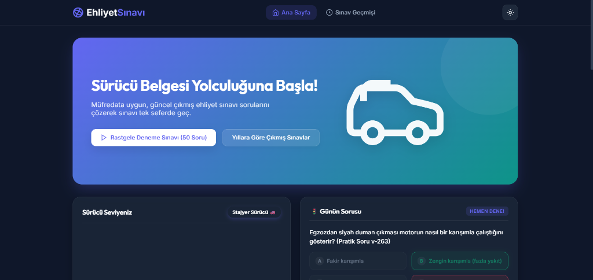
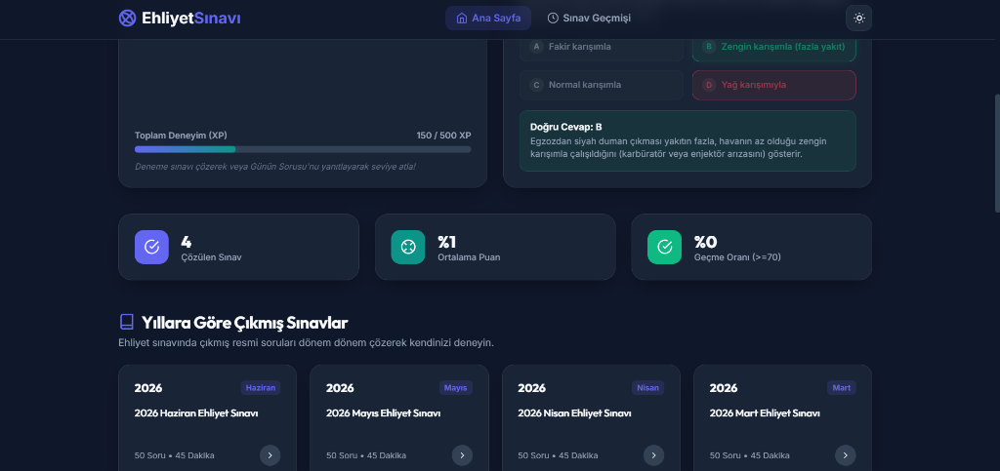
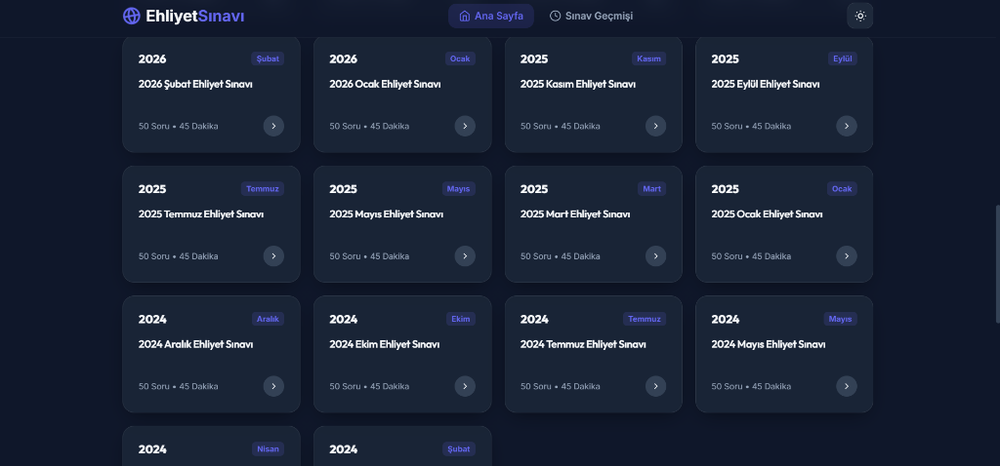
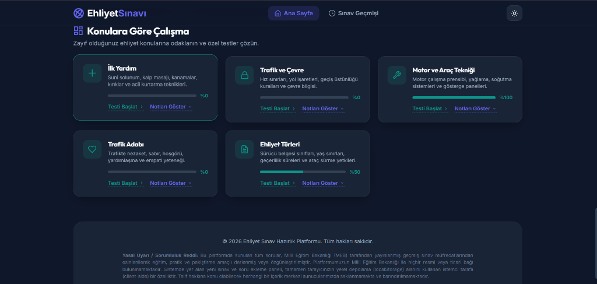
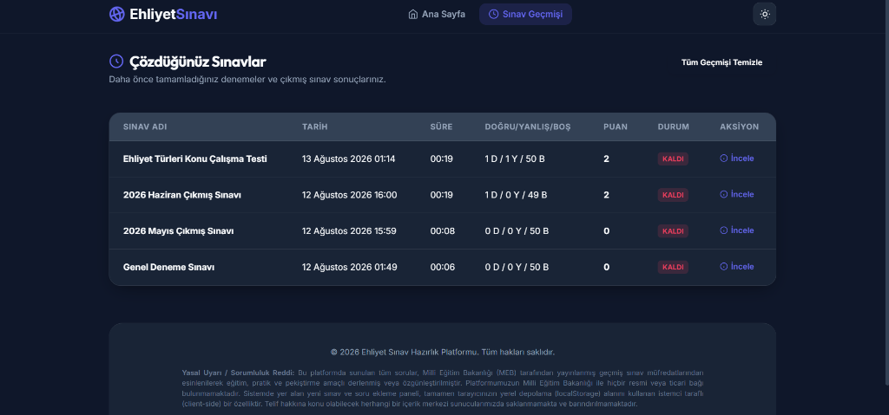
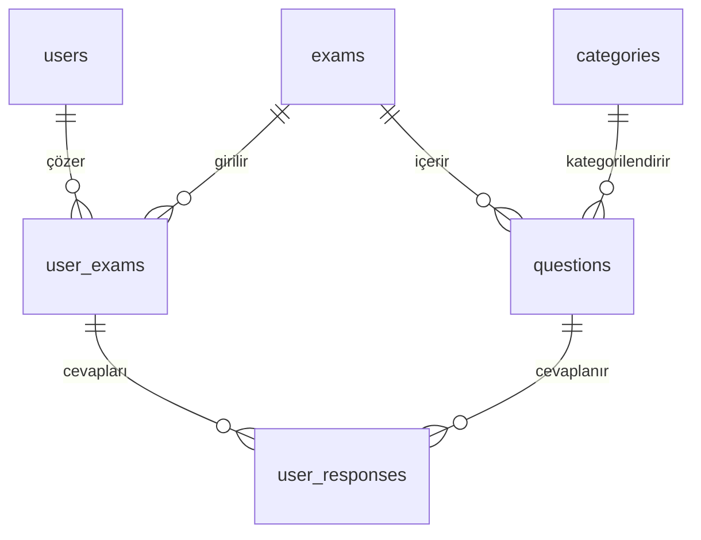

# Ehliyet Sınavına Hazırlık Web Sitesi

Bu proje, kullanıcıların çıkmış ehliyet sınav sorularını (yıl ve ay bazında kategorize edilmiş olarak) çözebilecekleri, konu kategorilerine göre (İlk Yardım, Trafik, Motor, Trafik Adabı) çalışabilecekleri, sınav sürelerini ve başarı oranlarını modern bir grafik arayüzle takip edebilecekleri, mobil uyumlu ve şık bir Single Page Application (SPA) web uygulamasıdır.

Uygulama, veritabanı yapısı (SQL şemaları ve Express.js API rotaları) dahil olmak üzere frontend ve backend mimarileriyle birlikte tasarlanmıştır.

## 📸 Ekran Görüntüleri

### 🖥️ Masaüstü Arayüzü (Karanlık Mod)

#### 1. Ana Sayfa (Karşılama & Günün Sorusu)


#### 2. İstatistikler & İlerleme Paneli


#### 3. Yıllara Göre Çıkmış Sınavlar


#### 4. Konulara Göre Çalışma


#### 5. Sınav Geçmişi (Çözdüğünüz Sınavlar)


---

## 🚀 Teknolojik Mantık ve Özellikler

### 1. Frontend Tasarımı
- **Gelişmiş CSS Teması (Aydınlık/Karanlık):** CSS Değişkenleri (`variables`) ve modern Cam Efekti (Glassmorphism) kullanılarak tasarlanmıştır. Koyu mod varsayılandır ve sistem ayarlarına veya kullanıcı tercihine göre aydınlık moda geçebilir.
- **Mobil Öncelikli Tasarım (Responsive):** Akıllı telefonlar, tabletler ve masaüstü ekranlar için optimize edilmiş esnek ızgaralar (`CSS Grid` ve `Flexbox`). Mobilde kolay kullanım için alt navigasyon barı barındırır.
- **Klavye Desteği:** Sınav modunda `A, B, C, D` tuşlarıyla şıkları işaretleyebilir, `Sol/Sağ Yön` tuşlarıyla sorular arasında gezinebilir ve `F` tuşuyla soruları işaretleyebilirsiniz.
- **Sınav Geçmişi ve İstatistikler:** Tüm sınav verileriniz tarayıcının yerel hafızasında (`localStorage`) saklanır, böylece internet gitse dahi sonuçlarınız kaybolmaz.

### 2. Gelişmiş Özellikler
- **Yapay Zeka Destekli Sesli Okuma:** Sınav veya inceleme ekranında soruların ve şıkların tarayıcının yerel TTS motoru (`Web Speech API`) kullanılarak sesli okunabilmesi.
- **Oyunlaştırma (Gamification):** Çözülen her sınav ve soru sonucunda kazanılan XP puanları ile seviye atlama (Stajyer Sürücü -> Direksiyon Ustası).
- **Günün Sorusu:** Her gün tarih tabanlı olarak değişen ve kullanıcıyı her gün test eden deterministik algoritmalı günlük soru widget'ı.
- **Dinamik 550 Soru Havuzu:** RAM üzerinde çalışan dinamik veri çoğaltma (data hydration) motoru sayesinde ham soruları 550 adet benzersiz soruya çıkaran ve tüm konu testlerini ile çıkmış sınavları otomatik 50 soruya tamamlayan sınav motoru.

### 3. Backend & Veritabanı Yapısı (`/backend` klasöründe)
- **SQL Şeması (`backend/database.sql`):** İlişkisel veritabanı tasarımı (SQLite, PostgreSQL, MySQL uyumlu). Kullanıcılar, kategoriler, sınavlar, sorular, kullanıcı sınavları ve kullanıcı cevapları arasındaki ilişkileri tutar.
- **Örnek Veriler (`backend/sample_data.sql`):** Gerçek ehliyet sınavı sorularını veritabanına aktarmak için hazır insert komutları.
- **API Rotaları (`backend/api_routes.js`):** Express.js backend sunucunuz için örnek endpoints ve DB sorgularını barındırır.

---

## 📂 Dosya Yapısı

```text
Ehliyetsınavıwebsitesi/
│
├── index.html                  # Ana HTML5 arayüzü ve SPA şablonları
├── styles.css                  # Karanlık mod, animasyonlar ve mobil uyumlu CSS
├── app.js                      # Sınav motoru, süre kontrolü, router ve local storage mantığı
├── questions_data.js           # Yıl/Ay bazlı çıkmış sorular ve dinamik soru üretici motor
├── LICENSE                     # MIT Lisans belgesi
├── .gitignore                  # Git dışlama dosyası
│
├── backend/
│   ├── database.sql            # Veritabanı tabloları şeması
│   └── sample_data.sql         # Örnek soruları içeren SQL komutları
│
└── README.md                   # Kurulum ve Çalıştırma Kılavuzu
```

---

## 📈 Veritabanı Tablo İlişkileri (ER İlişkisi)



1. **`users` -> `user_exams`:** Bir kullanıcı birden fazla sınava girebilir.
2. **`exams` -> `questions`:** Bir sınav birden fazla sorudan oluşabilir.
3. **`categories` -> `questions`:** Her sorunun bir konusu (İlk Yardım, Trafik vb.) olmak zorundadır.
4. **`user_exams` -> `user_responses`:** Kullanıcının girdiği sınavdaki her bir soruya verdiği yanıtlar (`chosen_option`) analiz için bu tabloda saklanır.

---

## ⚖️ Lisans

Bu proje **MIT Lisansı** altında lisanslanmıştır. Detaylar için [LICENSE](LICENSE) dosyasına göz atabilirsiniz.
